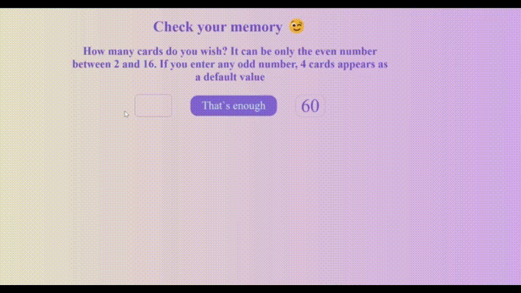
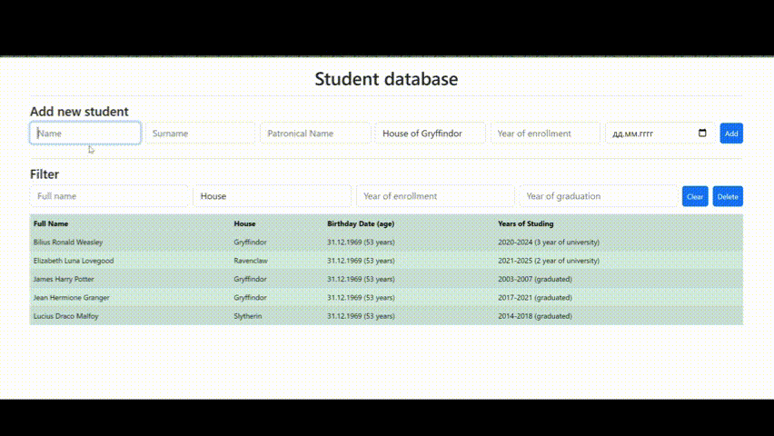

# Hi, my name is Ale!

###  About me:

```javascript
const ale = {
  technologies: {
    code: ['JS', 'TS', 'HTML', 'CSS', 'SASS'],
    tools: ['React', 'Redux', 'Jest', 'Cypress'],
    mustHave: ['GIT', 'WebPack', 'Gulp'],
  },
  others: {
    graphics: ['Figma', 'Photoshop'],
    architecture: ['SPA', 'MPA'],
    softSkills: ['Problem-solving', 'Time management', 'Teamwork and collaboration', 'Passion for learning new things'],
  },
  funFact: 'There are two ways to write error-free programs; only the third one works',
};
```

---

### 💻 Skills:

<div>
  &nbsp
  &nbsp
  &nbsp
  &nbsp
  &nbsp
  <!-- &nbsp -->
  <!-- &nbsp -->
  <!-- &nbsp -->
  &nbsp;
  &nbsp;
  &nbsp;
  &nbsp;
  &nbsp;
  &nbsp;
</div>

---

### 💻 Codewars:


---

### ⚙️ GitHub statistic:


---

### Projects overview:

<table>
  <tr>
    <td width='440px'>
      
    </td>
    <td with='400px'>
      <h3>Blanchard Gallery</h3>
      <p>Training project for web-layout basic course</p>
      <p>Technologies: HTML, CSS, JS</p>
      <p>
        <a href='https://alena-nechaeva.github.io/final_project_BLANCHARD/'>View Blanchard on GitHub Pages</a>
      </p>
      <p>JS libraries:</p>
      <ul>
        <li>Slider JS</li>
        <li>Accordion JS</li>
        <li>Choices</li>
        <li>Just-validate</li>
        <li>Inputmask</li>
        <li>Tippy</li>
      </ul>
    </td>
  </tr>
  <tr>
    <td width='440px'>
      
    </td>
    <td with='400px'>
      <h3>Simple Memory Game</h3>
      <p>Training project for JS basic course</p>
      <p>Technologies: JS native</p>
      <p>
        <a href='https://alena-nechaeva.github.io/Pairs-card-game/'>View on GitHub Pages</a>
      </p>
    </td>
  </tr>
  <tr>
    <td width='440px'>
      
    </td>
    <td with='400px'>
      <h3>Students control panel</h3>
      <p>Training project for JS basic course</p>
      <p>Technologies: JS native, Local Storage, OOP</p>
      <p>
        <a href='https://alena-nechaeva.github.io/students-control-panel/'>View on GitHub Pages</a>
      </p>
    </td>
  </tr>
</table>
