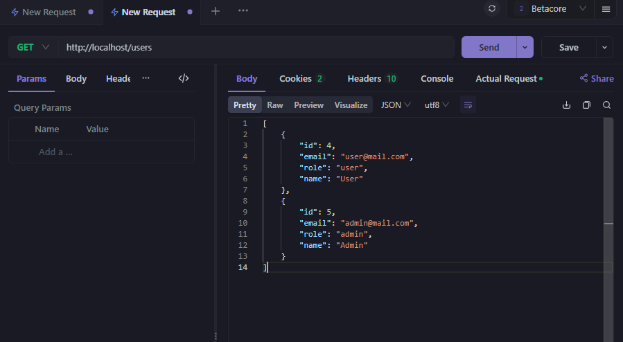
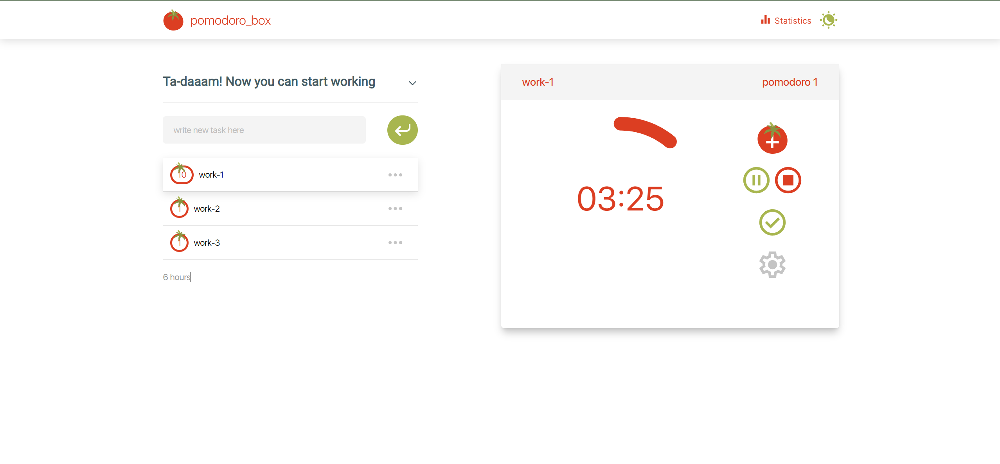
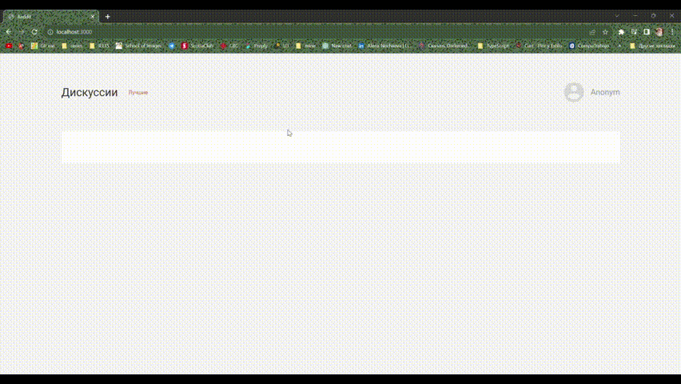
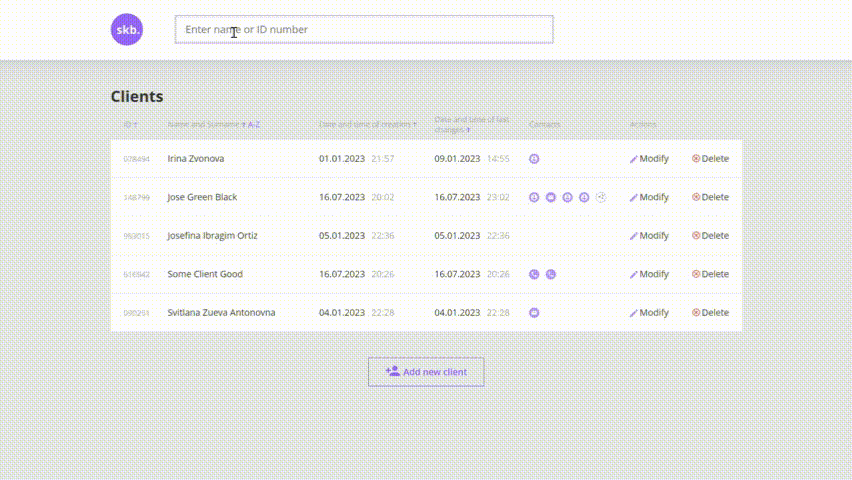
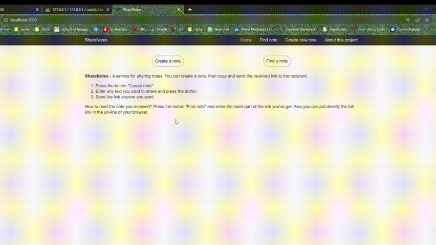
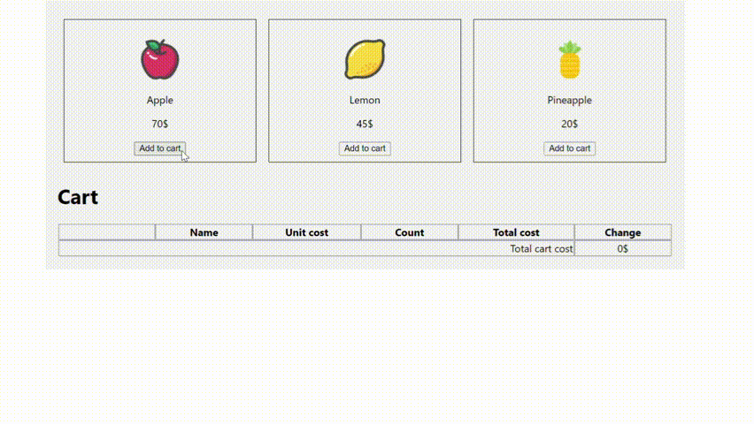
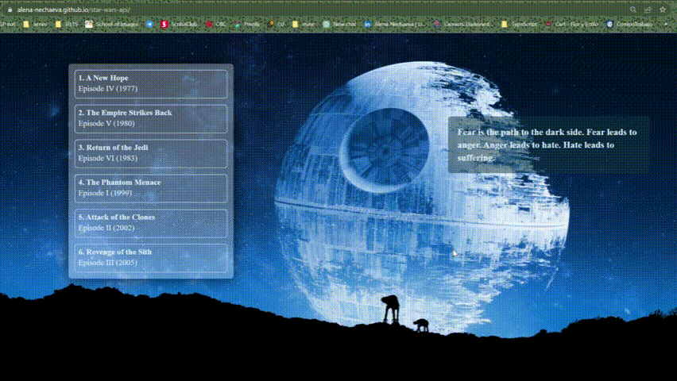

# Hi, I'm Ale :wave: Welcome to my GitHub!

###  About me:

```javascript
const ale = {
  technologies: {
    code: ['JS', 'TS', , 'Tailwindcss', 'HTML5', 'CSS/SASS'],
    tools: ['NextJS', 'ReactJS', 'Redux', 'Jest', 'Cypress'],
    mustHave: ['GIT', 'WebPack', 'Gulp'],
  },
  others: {
    graphics: ['Figma', 'Photoshop'],
    architecture: ['SPA', 'MPA'],
    softSkills: ['Problem-solving', 'Time management', 'Teamwork and collaboration', 'Passion for learning new things'],
  },
  funFact: 'There are two ways to write error-free programs; only the third one works',
};
```

---

### 💻 Skills:

<div>
  &nbsp;
  &nbsp;
  &nbsp;
  &nbsp;
  &nbsp;
  &nbsp;
  &nbsp
  &nbsp;
  &nbsp;
&nbsp;
&nbsp;
&nbsp;
  <!-- &nbsp -->
  <!-- &nbsp -->
  <!-- &nbsp -->
  <!-- &nbsp; -->
</div>

---

### :bulb: Codewars:


---

### ⚙️ GitHub statistic:


---

### Projects overview:

<table>
<tr>
    <td width='440px'>
      
    </td>
    <td with='400px'>
      <h3>REST API built with native PHP</h3>
      <p>Training project for PHP course. </p>
      <p>Technologies: PHP native</p>
      <p>
        <a href='https://github.com/Alena-Nechaeva/fileStoragePHP'>Go to GitHub repositoryyyy</a>
      </p>
    </td>
  </tr>
  <tr>
<tr>
    <td width='440px'>
      
    </td>
    <td with='400px'>
      <h3>Pomodoro timer</h3>
      <p>Training project for React course. </p>
      <p>Technologies: NextJS, Tailwindcss, ChartJS, Moment, IndexedDB</p>
      <p>
        <a href='https://pomodoro-timer-beta.vercel.app/'>View on Vercel</a>
      </p>
      <p>
        <a href='https://github.com/Alena-Nechaeva/pomodoro-timer'>Go to GitHub repository</a>
      </p>
    </td>
  </tr>
  <tr>
    <td width='440px'>
      
    </td>
    <td with='400px'>
      <h3>Reddit Mirror</h3>
      <p>Training project for React course. </p>
      <p>Technologies: React JS, TypeScript, SSR, reddit API</p>
      <p>
        <a href='https://github.com/Alena-Nechaeva/reddit-mirror'>Go to GitHub repository</a>
      </p>
    </td>
  </tr>
   <tr>
    <td width='440px'>
      
    </td>
    <td with='400px'>
      <h3>Simple CRM</h3>
      <p>Course project for JS basic course</p>
      <p>Technologies: JS native, OOP, Local Storage</p>
      <p>
        <a href='https://github.com/Alena-Nechaeva/Final-Project-CRM-Clients'>Go to GitHub repository</a>
      </p>
    </td>
  </tr>
  <tr>
    <td width='440px'>
      
    </td>
    <td with='400px'>
      <h3>Online shop SitDownPls</h3>
      <p>MPA. Course project for Web-layout advanced course</p>
      <p>Technologies: JS native, Sass, Gulp, HTML modules</p>
      <p>JS libraries:</p>
      <p>Slider JS, Choices, Inputmask</p>
      <p>
        <a href='https://alena-nechaeva.github.io/SitDownPls-build/'>View on GitHub Pages</a>
      </p>
      <p>
        <a href='https://github.com/Alena-Nechaeva/SitDownPls-src'>Go to GitHub repository</a>
      </p>
    </td>
  </tr>
  <tr>
    <td width='440px'>
      
    </td>
    <td with='400px'>
      <h3>Share notes service</h3>
      <p>Training project for React course(SPA)</p>
      <p>Technologies: React, React-DOM, React-route, working with db</p>
      <p>
        <a href='https://github.com/Alena-Nechaeva/share-notes-spa'>Go to GitHub repository</a>
      </p>
    </td>
  </tr>
  <tr>
    <td width='440px'>
      
    </td>
    <td with='400px'>
      <h3>Simple cart created with React+Redux</h3>
      <p>Training project for React course. The main goal of this project was to understand how Redux and React can work together</p>
      <p>Technologies: React, React-DOM, Redux</p>
      <p>
        <a href='https://github.com/Alena-Nechaeva/fruit-cart-react'>Go to GitHub repository</a>
      </p>
    </td>
  </tr>
  <tr>
    <td width='440px'>
      
    </td>
    <td with='400px'>
      <h3>Students control panel</h3>
      <p>Training project for JS basic course</p>
      <p>Technologies: JS native, Local Storage, OOP</p>
      <p>
        <a href='https://alena-nechaeva.github.io/students-control-panel/'>View on GitHub Pages</a>
      </p>
      <p>
        <a href='https://github.com/Alena-Nechaeva/students-control-panel'>Go to GitHub repository</a>
      </p>
    </td>
  </tr>
    <tr>
    <td width='440px'>
      
    </td>
    <td with='400px'>
      <h3>Simple Memory Game</h3>
      <p>Training project for JS basic course</p>
      <p>Technologies: JS native</p>
      <p>
        <a href='https://alena-nechaeva.github.io/Pairs-card-game/'>View on GitHub Pages</a>
      </p>
      <p>
        <a href='https://github.com/Alena-Nechaeva/Pairs-card-game'>Go to GitHub repository</a>
      </p>
    </td>
  </tr>
  <tr>
    <td width='440px'>
      
    </td>
    <td with='400px'>
      <h3>Star Wars API</h3>
      <p>Training project for JS basic course. This project was created as a training project within the framework of an advanced JS course. The main goal of this simple application was to create a function that would render all the information at once, and not load the information as it arrives.</p>
      <p>Technologies: JS native, Css</p>
        <p>
        <a href='https://alena-nechaeva.github.io/star-wars-api/'>View on GitHub pages</a>
      </p>
      <p>
        <a href='https://github.com/Alena-Nechaeva/star-wars-api'>Go to GitHub repository</a>
      </p>
    </td>
  </tr>
    <tr>
    <td width='440px'>
      
    </td>
    <td with='400px'>
      <h3>Blanchard Gallery</h3>
      <p>Course project for web-layout basic course</p>
      <p>Technologies: HTML, CSS, JS</p>
      <p>
        <a href='https://alena-nechaeva.github.io/final_project_BLANCHARD/'>View Blanchard on GitHub Pages</a>
      </p>
      <p>
        <a href='https://github.com/Alena-Nechaeva/final_project_BLANCHARD'>Go to GitHub repository</a>
      </p>
      <p>JS libraries:</p>
      <ul>
        <li>Slider JS</li>
        <li>Accordion JS</li>
        <li>Choices</li>
        <li>Just-validate</li>
        <li>Inputmask</li>
        <li>Tippy</li>
      </ul>
    </td>
  </tr>
</table>
